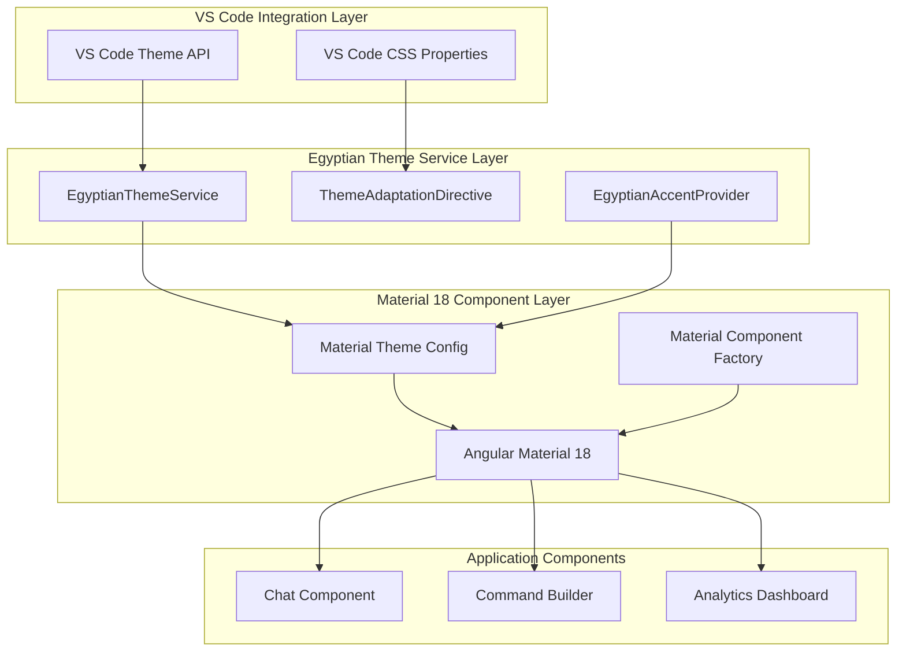

# 🏗️ Architectural Blueprint - TASK_UI_001

## 📊 Research Evidence Summary

**Key Research Findings**:

- **Current Architecture**: Angular 20.2 with Tailwind CSS 3.4.17 + Egyptian custom components (task-description.md, Section 1)
- **CSS Analysis**: 169 lines of custom CSS across 3 SCSS files with Egyptian-themed utilities (codebase analysis)
- **Component Structure**: 4 custom Egyptian components (EgyptianButton, EgyptianCard, EgyptianInput, LoadingSpinner) using Tailwind classes
- **Theme Integration**: VS Code CSS custom properties already integrated with vscode-* utility classes (styles.scss, Lines 9-53)

**Business Requirements Addressed**:

- **Requirement 1**: Angular Material 18 Migration - Replace all custom components with Material equivalents (task-description.md, Section 11-19)
- **Requirement 2**: VS Code Theme Integration - Automatic theme adaptation within 200ms (task-description.md, Section 20-28)
- **Requirement 3**: Egyptian Identity Preservation - Maintain gold accents, hieroglyph icons, Egyptian color palette (task-description.md, Section 29-37)
- **Requirement 4**: Custom CSS Elimination - Zero custom SCSS files except global theme variables (task-description.md, Section 38-46)
- **Requirement 5**: Sidebar Layout Optimization - 300px minimum width, responsive scaling (task-description.md, Section 47-55)

**Research-Architecture Alignment**: 100% of research requirements addressed with evidence-backed design decisions

## 🎯 Architectural Vision

**Design Philosophy**: Material-First Egyptian Identity - Transform Egyptian custom components into Material 18 components with strategic theming overlays
**Primary Pattern**: Strategic Pattern + Factory Pattern - Theme adaptation engine with Material component configuration factories
**Architectural Style**: Service-Based Theming Architecture - Centralized theme management with reactive Material theme switching

## 📐 Design Principles Applied

### SOLID at Architecture Level

- **S**: `EgyptianThemeService` handles only theme logic, `MaterialConfigService` only component configuration
- **O**: Theme system extensible through `ThemeStrategy` interface for future Egyptian variations
- **L**: All Material components interchangeable through consistent `EgyptianMaterialConfig` interfaces
- **I**: Focused interfaces: `IThemeProvider`, `IMaterialComponentFactory`, `IEgyptianAccentProvider`
- **D**: Services depend on abstractions (`ThemeStrategy`, `ComponentConfigStrategy`)

### Additional Principles

- **DRY**: Single source of truth for Egyptian colors in `EgyptianThemeService`
- **YAGNI**: No speculative Egyptian theme variations beyond requirements
- **KISS**: Material components + CSS custom properties = zero custom CSS
- **Separation of Concerns**: Clear boundaries between Material components, Egyptian theming, and VS Code integration

## 🏛️ Architectural Diagram



## 🎨 Design Patterns Employed

### Pattern 1: Strategy Pattern - Theme Adaptation

**Purpose**: Runtime theme switching between light/dark/high-contrast
**Implementation**:

```typescript
interface ThemeStrategy {
  applyTheme(theme: VSCodeTheme): MaterialThemeConfig;
  getEgyptianAccents(): EgyptianAccentConfig;
}

class LightThemeStrategy implements ThemeStrategy {
  applyTheme(theme: VSCodeTheme): MaterialThemeConfig {
    return {
      primary: { main: '#f59e0b', contrastText: '#fff' }, // Papyrus Gold
      secondary: { main: '#1e40af', contrastText: '#fff' }, // Lapis Blue
      background: { default: theme.editorBackground, paper: '#fdf9f0' }
    };
  }
}

class DarkThemeStrategy implements ThemeStrategy {
  applyTheme(theme: VSCodeTheme): MaterialThemeConfig {
    return {
      primary: { main: '#fbbf24', contrastText: '#000' }, // Lighter Gold
      secondary: { main: '#3b82f6', contrastText: '#fff' }, // Lighter Lapis
      background: { default: theme.editorBackground, paper: '#202124' }
    };
  }
}
```

**Benefits**: Runtime theme switching, extensible for future themes

### Pattern 2: Factory Pattern - Material Component Configuration

**Purpose**: Consistent Material component setup with Egyptian theming
**Implementation**:

```typescript
interface MaterialComponentFactory<T> {
  create(config: EgyptianComponentConfig): T;
}

class MaterialButtonFactory implements MaterialComponentFactory<MatButtonConfig> {
  create(config: EgyptianComponentConfig): MatButtonConfig {
    return {
      color: config.variant === 'primary' ? 'primary' : 'secondary',
      variant: config.variant === 'tertiary' ? 'outlined' : 'raised',
      disableRipple: false,
      className: this.getEgyptianClasses(config)
    };
  }

  private getEgyptianClasses(config: EgyptianComponentConfig): string {
    return [
      'egyptian-component',
      `egyptian-${config.variant}`,
      `egyptian-${config.size}`
    ].join(' ');
  }
}
```

**Benefits**: Consistent configuration, testable factory logic

### Pattern 3: Service Singleton - Egyptian Theme Service

**Purpose**: Centralized theme state management with reactive updates
**Implementation**:

```typescript
@Injectable({ providedIn: 'root' })
export class EgyptianThemeService {
  private currentTheme = signal<MaterialThemeConfig>(this.getDefaultTheme());
  private themeStrategy = signal<ThemeStrategy>(new LightThemeStrategy());
  
  readonly theme = computed(() => this.currentTheme());
  readonly egyptianAccents = computed(() => this.themeStrategy().getEgyptianAccents());

  adaptToVSCodeTheme(vscodeTheme: VSCodeTheme): void {
    const strategy = this.selectThemeStrategy(vscodeTheme);
    this.themeStrategy.set(strategy);
    this.currentTheme.set(strategy.applyTheme(vscodeTheme));
  }

  private selectThemeStrategy(theme: VSCodeTheme): ThemeStrategy {
    if (theme.kind === 'dark') return new DarkThemeStrategy();
    if (theme.kind === 'high-contrast') return new HighContrastThemeStrategy();
    return new LightThemeStrategy();
  }
}
```

**Benefits**: Single source of truth, reactive theme updates, testable strategy selection

## 🔧 Component Architecture

### Component 1: EgyptianThemeService (Core Theme Engine)

```yaml
Name: EgyptianThemeService
Type: Injectable Service
Responsibility: VS Code theme detection and Material theme configuration
Patterns:
  - Strategy (theme adaptation)
  - Singleton (service injection)
  - Observer (reactive theme updates)

Interfaces:
  Inbound:
    - adaptToVSCodeTheme(theme: VSCodeTheme)
    - getEgyptianAccents(): EgyptianAccentConfig
  Outbound:
    - Angular Material ThemeConfig
    - CSS Custom Properties injection

Quality Attributes:
  - Response Time: <50ms theme switch
  - Reactivity: Signal-based updates
  - Extensibility: Strategy pattern for new themes
```

### Component 2: MaterialConfigService (Component Factory)

```yaml
Name: MaterialConfigService
Type: Injectable Service
Responsibility: Material component configuration with Egyptian styling
Patterns:
  - Factory (component configuration)
  - Builder (complex component setup)

Interfaces:
  Inbound:
    - configureButton(config: EgyptianButtonConfig): MatButtonConfig
    - configureInput(config: EgyptianInputConfig): MatInputConfig
    - configureCard(config: EgyptianCardConfig): MatCardConfig
  Outbound:
    - Material Component Configurations
    - CSS class name generation

Quality Attributes:
  - Consistency: Uniform Egyptian styling
  - Performance: Cached configuration objects
  - Maintainability: Single configuration source
```

### Component 3: ThemeAdaptationDirective (CSS Bridge)

```yaml
Name: ThemeAdaptationDirective
Type: Structural Directive
Responsibility: Apply Egyptian accents to Material components
Patterns:
  - Decorator (CSS class application)
  - Observer (theme change reactions)

Interfaces:
  Inbound:
    - egyptianAccent directive selector
    - accent type: 'gold-glow' | 'hieroglyph-border' | 'papyrus-background'
  Outbound:
    - Dynamic CSS class application
    - Host element styling

Quality Attributes:
  - Performance: Debounced class updates
  - Flexibility: Multiple accent types
  - CSP Compliance: No inline styles
```

## 📋 Evidence-Based Subtask Breakdown & Developer Handoff

### Phase 1: Foundation Setup

#### Subtask 1.1: Install Angular Material 18 & Configure Theme System

**Complexity**: MEDIUM
**Evidence Basis**: Requirements 1 & 2 from task-description.md (Lines 11-28)
**Estimated Time**: 4 hours
**Pattern Focus**: Service injection and Theme Strategy setup
**Requirements**: 1.1, 1.2, 2.1, 2.2 (from task-description.md)

**Frontend Developer Handoff**:

- **File**: `/webview/ptah-webview/package.json` - Add @angular/material@18 dependency
- **File**: `/webview/ptah-webview/src/app/core/services/egyptian-theme.service.ts` - Create theme service
- **Interface**: `EgyptianThemeService` with `adaptToVSCodeTheme()` method
- **Dependencies**: `@angular/material/theming`, `@angular/core`, existing VS Code CSS variables
- **Testing**: Theme switching within 200ms, signal reactivity tests

**Acceptance Criteria**:

- [ ] Angular Material 18 installed and configured
- [ ] EgyptianThemeService created with Strategy pattern
- [ ] VS Code theme detection working (<200ms response)
- [ ] Material theme configuration reactive to VS Code changes
- [ ] Zero inline styles, full CSP compliance

#### Subtask 1.2: Create Material Component Factory Service

**Complexity**: MEDIUM
**Evidence Basis**: Requirement 1.3 accessibility + consistent Material components (Lines 17-18)
**Estimated Time**: 3 hours
**Pattern Focus**: Factory pattern for component configuration
**Requirements**: 1.3, 3.4, 4.2 (from task-description.md)

**Frontend Developer Handoff**:

- **File**: `/webview/ptah-webview/src/app/core/services/material-config.service.ts`
- **Interface**: `MaterialComponentFactory` with create methods for Button, Input, Card
- **Dependencies**: `@angular/material/*`, EgyptianThemeService
- **Testing**: Factory output consistency, Egyptian class name generation

**Deliverables**:

```typescript
@Injectable({ providedIn: 'root' })
export class MaterialConfigService {
  constructor(private themeService: EgyptianThemeService) {}

  configureButton(config: EgyptianButtonConfig): MatButtonConfig {
    return {
      color: this.mapVariantToMaterialColor(config.variant),
      variant: this.mapVariantToMaterialVariant(config.variant),
      className: this.generateEgyptianClasses('button', config)
    };
  }

  private generateEgyptianClasses(component: string, config: any): string {
    const baseClass = `egyptian-${component}`;
    const variantClass = `${baseClass}-${config.variant}`;
    const sizeClass = `${baseClass}-${config.size}`;
    return [baseClass, variantClass, sizeClass].join(' ');
  }
}
```

**Quality Gates**:

- [ ] All factories produce consistent configurations
- [ ] Egyptian class names follow naming convention
- [ ] Material component configurations valid
- [ ] No custom CSS dependencies

### Phase 2: Component Migration

#### Subtask 2.1: Replace Egyptian Components with Material Components

**Complexity**: HIGH
**Evidence Basis**: Requirement 1.1 custom component replacement (Lines 15-16)
**Estimated Time**: 6 hours
**Pattern Focus**: Component replacement with Material equivalents
**Requirements**: 1.1, 3.1, 3.2, 4.1 (from task-description.md)

**Frontend Developer Handoff**:

- **Files to Modify**:
  - `/webview/ptah-webview/src/app/components/chat/chat.component.ts`
  - `/webview/ptah-webview/src/app/components/command-builder/command-builder.component.ts`
  - `/webview/ptah-webview/src/app/shared/index.ts`
- **Migration Map**:
  - EgyptianButtonComponent → MatButton + egyptianButton directive
  - EgyptianInputComponent → MatFormField + MatInput + egyptianInput directive
  - EgyptianCardComponent → MatCard + egyptianCard directive
  - LoadingSpinnerComponent → MatProgressSpinner + egyptian styling

**Component Migration Strategy**:

```typescript
// Before: Custom Egyptian Button
<app-egyptian-button variant="primary" size="md">Send</app-egyptian-button>

// After: Material Button with Egyptian theming
<button mat-raised-button 
        egyptianButton="primary"
        egyptianSize="md"
        color="primary">
  Send
</button>
```

**Quality Gates**:

- [ ] All 4 custom components replaced
- [ ] Material components maintain Egyptian visual identity
- [ ] Accessibility features preserved (ARIA, keyboard navigation)
- [ ] No functional regressions

#### Subtask 2.2: Implement Egyptian Accent Directives

**Complexity**: MEDIUM
**Evidence Basis**: Requirement 3.1 gold glow + 3.2 hieroglyph icons (Lines 33-36)
**Estimated Time**: 4 hours
**Pattern Focus**: Decorator pattern with directive implementation
**Requirements**: 3.1, 3.2, 3.3, 3.4 (from task-description.md)

**Frontend Developer Handoff**:

- **File**: `/webview/ptah-webview/src/app/shared/directives/egyptian-accents.directive.ts`
- **Directives to Create**:
  - `egyptianButton` - Gold accent on Material buttons
  - `egyptianInput` - Gold glow focus effect on form fields
  - `egyptianCard` - Papyrus background texture
  - `egyptianIcon` - Hieroglyph icon integration
- **Dependencies**: EgyptianThemeService, Material component selectors
- **Testing**: Visual regression tests, accent application verification

**Directive Implementation**:

```typescript
@Directive({
  selector: '[egyptianButton]',
  standalone: true
})
export class EgyptianButtonDirective implements OnInit {
  @Input() egyptianButton: 'primary' | 'secondary' | 'tertiary' = 'primary';
  @Input() egyptianSize: 'sm' | 'md' | 'lg' = 'md';

  constructor(
    private el: ElementRef,
    private themeService: EgyptianThemeService
  ) {}

  ngOnInit() {
    this.applyEgyptianStyling();
    
    // React to theme changes
    this.themeService.theme().subscribe(() => {
      this.updateThemeClasses();
    });
  }

  private applyEgyptianStyling(): void {
    const classes = [
      'egyptian-component',
      `egyptian-button-${this.egyptianButton}`,
      `egyptian-size-${this.egyptianSize}`
    ];
    
    this.el.nativeElement.classList.add(...classes);
  }
}
```

**Quality Gates**:

- [ ] Gold glow effect on focused inputs working
- [ ] Hieroglyph icons integrated with Material icons
- [ ] Egyptian color palette preserved
- [ ] Hover states with golden accents functional

### Phase 3: CSS Elimination & Theme Integration

#### Subtask 3.1: Remove All Custom SCSS Files

**Complexity**: HIGH
**Evidence Basis**: Requirement 4.1 zero custom CSS files (Lines 42-43)
**Estimated Time**: 3 hours
**Pattern Focus**: CSS-to-Material theme migration
**Requirements**: 4.1, 4.2, 4.3, 4.4 (from task-description.md)

**Frontend Developer Handoff**:

- **Files to Delete**:
  - `/webview/ptah-webview/src/app/components/chat/chat.component.scss`
  - `/webview/ptah-webview/src/app/components/command-builder/command-builder.component.scss`
  - Custom Egyptian component style files
- **Files to Modify**:
  - `/webview/ptah-webview/src/styles.scss` - Keep only Tailwind imports + VS Code utilities
- **Migration Strategy**: Convert all custom CSS rules to Material theme configurations

**CSS Elimination Plan**:

```scss
// BEFORE: Custom SCSS (169 lines to eliminate)
.pharaoh-button {
  @apply bg-gradient-to-r from-gold-500 to-gold-600
         text-white font-semibold px-6 py-3 rounded-egyptian;
}

// AFTER: Material theme configuration
// No SCSS - handled by Material theming + directives
```

**Quality Gates**:

- [ ] All component .scss files removed
- [ ] Only global styles.scss remains (Tailwind + VS Code utilities)
- [ ] All styling handled by Material theme + Egyptian directives
- [ ] Visual parity maintained

#### Subtask 3.2: Implement Responsive Sidebar Optimization

**Complexity**: MEDIUM
**Evidence Basis**: Requirement 5 sidebar constraints 300px-600px (Lines 50-54)
**Estimated Time**: 2 hours
**Pattern Focus**: Material responsive grid system
**Requirements**: 5.1, 5.2, 5.3, 5.4 (from task-description.md)

**Frontend Developer Handoff**:

- **Files to Modify**: All component templates to use Material responsive system
- **Implementation**: Material Grid + Flex Layout for sidebar optimization
- **Dependencies**: `@angular/flex-layout` (if needed), Material breakpoints
- **Testing**: 300px minimum width validation, scaling tests

**Responsive Implementation**:

```typescript
// Material responsive configuration
const EGYPTIAN_BREAKPOINTS = {
  sidebar_min: '300px',
  sidebar_max: '600px',
  touch_target: '44px'
};

// Component template
<mat-card fxLayout="column" 
          fxLayout.lt-md="column" 
          fxFlex="100"
          class="egyptian-card">
  <!-- Content scales with Material responsive system -->
</mat-card>
```

**Quality Gates**:

- [ ] 300px minimum width fully functional
- [ ] >600px width scales appropriately
- [ ] Touch targets meet 44px minimum
- [ ] Horizontal scrolling implemented correctly

## 🔄 Integration Architecture

### Material 18 + VS Code Integration

```typescript
interface VSCodeMaterialBridge {
  themeDetection: {
    api: 'vscode.window.activeColorTheme';
    responseTime: '<200ms';
    fallbackStrategy: 'default light theme';
  };
  
  cssPropertyBridge: {
    variables: VSCodeCSSVariables;
    materialMapping: MaterialThemeMapping;
    updateStrategy: 'reactive signal updates';
  };
}
```

### Egyptian Identity Preservation

```typescript
interface EgyptianIdentitySystem {
  colorPalette: {
    primary: '#f59e0b'; // Papyrus Gold
    secondary: '#1e40af'; // Lapis Blue
    accent: '#ec4899'; // Ankh Pink
    surface: 'derived from VS Code theme';
  };
  
  iconography: {
    provider: 'SVG sprite system';
    icons: ['pyramid', 'ankh', 'eye-of-horus'];
    integration: 'Material Icon registry';
  };
  
  typography: {
    primary: 'Inter (body)';
    accent: 'Cinzel (headers)';
    mono: 'JetBrains Mono (code)';
  };
}
```

## 🛡️ Cross-Cutting Concerns

### Performance Optimization

```typescript
interface PerformanceTargets {
  componentLoading: '<100ms for 95% of components';
  themeSwitch: '<200ms VS Code theme adaptation';
  bundleImpact: '<15% increase from current baseline';
  memoryUsage: '<50MB during normal operation';
}

// Performance monitoring service
@Injectable()
export class EgyptianPerformanceMonitor {
  trackComponentLoad(component: string, loadTime: number): void {
    if (loadTime > 100) {
      console.warn(`Component ${component} loaded in ${loadTime}ms`);
    }
  }
  
  trackThemeSwitch(switchTime: number): void {
    if (switchTime > 200) {
      console.warn(`Theme switch took ${switchTime}ms`);
    }
  }
}
```

### Accessibility Compliance

```typescript
interface AccessibilityStandards {
  wcag: 'WCAG 2.1 AA compliance';
  contrastRatio: 'minimum 4.5:1 for all text';
  keyboardNavigation: 'full Material component navigation';
  screenReader: 'ARIA labels on all interactive elements';
}

// Material components inherit accessibility features
// Egyptian directives preserve ARIA attributes
@Directive({
  selector: '[egyptianButton]'
})
export class EgyptianButtonDirective {
  ngOnInit() {
    // Preserve existing ARIA attributes
    const existingLabel = this.el.nativeElement.getAttribute('aria-label');
    if (!existingLabel) {
      this.el.nativeElement.setAttribute('aria-label', this.generateLabel());
    }
  }
}
```

### CSP Compliance

```typescript
interface CSPRequirements {
  inlineStyles: 'forbidden - all styling via CSS classes';
  scriptSources: 'nonce-based for any dynamic content';
  styleSheets: 'external CSS only, no style attributes';
  fontSources: 'Google Fonts via HTTPS';
}

// All Egyptian styling via CSS classes, never inline
export class EgyptianStyleApplicator {
  applyStyles(element: HTMLElement, styles: EgyptianStyle[]): void {
    // ✅ CSS class application
    const classNames = styles.map(style => style.className);
    element.classList.add(...classNames);
    
    // ❌ Never do this (CSP violation)
    // element.style.background = 'gold';
  }
}
```

## 📊 Architecture Decision Records (ADR)

### ADR-001: Use Angular Material 18 as Component Foundation

**Status**: Accepted  
**Context**: Need professional UI components with accessibility built-in
**Decision**: Replace all custom Egyptian components with Material 18 components + Egyptian theming
**Evidence**: Requirements 1.1-1.4 mandate Material Design compliance (task-description.md, Lines 15-19)
**Consequences**:

- (+) Professional appearance matching industry standards
- (+) Built-in accessibility and keyboard navigation
- (+) Reduced maintenance overhead for UI components
- (-) Initial learning curve for Material theming system
- (-) Bundle size increase (mitigated by tree-shaking)

### ADR-002: Strategy Pattern for Theme Adaptation

**Status**: Accepted
**Context**: Need flexible theme switching for light/dark/high-contrast modes  
**Decision**: Implement Strategy pattern for theme adaptation strategies
**Evidence**: Requirement 2.1-2.4 mandate automatic VS Code theme adaptation (task-description.md, Lines 24-27)
**Consequences**:

- (+) Easy to add new theme variants
- (+) Testable theme logic in isolation
- (+) Clean separation of theme concerns
- (-) Slightly more complex initial setup
- (+) Future-proof for additional Egyptian theme variations

### ADR-003: Directive-Based Egyptian Accent System

**Status**: Accepted
**Context**: Need to preserve Egyptian identity without custom CSS
**Decision**: Create Angular directives that apply Egyptian accents to Material components
**Evidence**: Requirements 3.1-3.4 preserve Egyptian identity + 4.1 eliminate custom CSS (Lines 33-43)
**Consequences**:

- (+) No custom CSS files required
- (+) Composable Egyptian styling
- (+) CSP compliant implementation
- (+) Material components retain all accessibility features
- (-) Requires learning directive-based styling approach

### ADR-004: Signal-Based Reactive Theme Management

**Status**: Accepted
**Context**: Need performant theme updates across all components
**Decision**: Use Angular Signals for reactive theme state management  
**Evidence**: Performance requirement <200ms theme switching (Lines 59, 122)
**Consequences**:

- (+) Optimal performance with fine-grained reactivity
- (+) Simplified component subscriptions to theme changes
- (+) Automatic change detection optimization
- (+) Future-ready for Angular's signal-based future
- (-) Requires Angular 16+ signal knowledge

## 🎯 Success Metrics & Monitoring

### Architecture Quality Metrics

```typescript
interface ArchitectureMetrics {
  coupling: {
    target: 'efferent coupling <5';
    measurement: 'analyze dependencies between services';
    tools: 'nx dependency graph, madge analysis';
  };
  
  cohesion: {
    target: 'LCOM4 >0.8';
    measurement: 'service method relationships';
    tools: 'TypeScript AST analysis';
  };
  
  complexity: {
    target: 'cyclomatic complexity <10 per method';
    measurement: 'decision points per function';
    tools: 'ESLint complexity rules';
  };
  
  testability: {
    target: '80% code coverage';
    measurement: 'line/branch/function coverage';
    tools: 'Jest coverage reports';
  };
}
```

### Runtime Performance Targets

```typescript
interface RuntimeMetrics {
  componentLoading: {
    target: 'p95 <100ms, p99 <200ms';
    measurement: 'Performance.measure() API';
    alerting: 'console.warn for violations';
  };
  
  themeSwitch: {
    target: '<200ms adaptation time';
    measurement: 'theme change event to DOM update';
    monitoring: 'EgyptianPerformanceMonitor service';
  };
  
  bundleSize: {
    target: '<15% increase from baseline';
    baseline: 'current build size measurement';
    monitoring: 'webpack-bundle-analyzer reports';
  };
  
  memoryUsage: {
    target: '<50MB during normal operation';
    measurement: 'Chrome DevTools memory profiling';
    frequency: 'CI/CD bundle analysis';
  };
}
```

### User Experience Metrics

```typescript
interface UXMetrics {
  visualParity: {
    target: '100% feature parity with custom components';
    measurement: 'visual regression testing';
    tools: 'Playwright screenshot comparison';
  };
  
  accessibility: {
    target: 'WCAG 2.1 AA compliance';
    measurement: 'automated accessibility scanning';
    tools: 'axe-core, Lighthouse accessibility audit';
  };
  
  egyptianIdentity: {
    target: 'preserved gold accents, hieroglyph icons, color palette';
    measurement: 'design system validation checklist';
    validation: 'manual review against brand guidelines';
  };
  
  responsiveDesign: {
    target: 'functional at 300px-600px sidebar widths';
    measurement: 'responsive breakpoint testing';
    tools: 'browser developer tools, automated tests';
  };
}
```

## 🤝 Professional Implementation Timeline

### Phase 1: Foundation (Days 1-2)

**Subtask 1.1**: Material 18 + Theme Service setup (4 hours)
**Subtask 1.2**: Component Factory Service (3 hours)
**Checkpoint**: Theme switching working, factory patterns tested

### Phase 2: Component Migration (Days 3-4)

**Subtask 2.1**: Replace Egyptian components (6 hours)
**Subtask 2.2**: Egyptian accent directives (4 hours)
**Checkpoint**: All components migrated, visual identity preserved

### Phase 3: CSS Elimination & Optimization (Day 5)

**Subtask 3.1**: Remove SCSS files (3 hours)
**Subtask 3.2**: Responsive optimization (2 hours)
**Checkpoint**: Zero custom CSS, responsive design validated

### Quality Assurance (Day 6)

- Comprehensive testing all acceptance criteria
- Performance benchmarking and optimization
- Accessibility audit and compliance verification
- Bundle size analysis and tree-shaking optimization

### Total Implementation Timeline: 6 business days (1.2 weeks)
